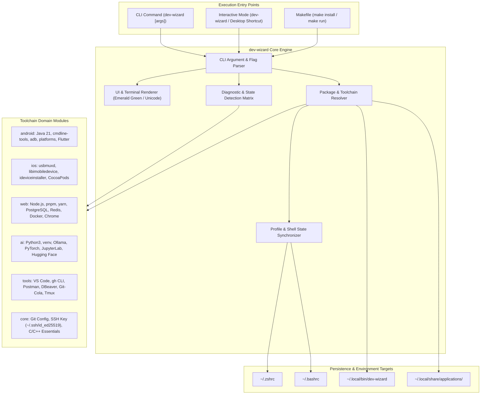

# System Architecture & Implementation Specification: Dev-Wizard CLI

**System:** `dev-wizard` (Development Environment & Toolchain Orchestrator)  
**Target Platform:** Linux (Debian, Ubuntu, Kali, Mint, Pop!_OS)  
**Shell Runtime:** POSIX Bash 4.4+  
**Design Standard:** Minimalist Terminal / Emerald Green Monochrome Theme (Zero Emojis)

---

## 1. Architectural Overview

The `dev-wizard` system is designed as an agentic, modular toolchain manager providing dual-mode execution:
1. **Interactive TUI (Terminal User Interface):** Menu-driven, scanner-guided, selective installer.
2. **Headless CLI Command Interface:** Direct flag-based execution tailored for DevOps engineers and command-line power users (`tech gurus`).



---

## 2. CLI Command Interface for Tech Gurus

After cloning the repository, tech users can either run the binary directly or install it globally into their system `PATH`:

```bash
# Direct execution from cloned directory:
./bin/dev-wizard [command] [options]

# Or install globally into ~/.local/bin:
make install
# Now available system-wide:
dev-wizard [command] [options]
```

### Supported Subcommands & Flags

| Command / Flag | Arguments | Description |
|---|---|---|
| `dev-wizard` | *(none)* | Launches the full interactive Terminal UI |
| `dev-wizard scan` or `-s` | `[category]` | Runs diagnostic check across all categories or a specified category (`android`, `ios`, `web`, `ai`, `tools`, `core`) |
| `dev-wizard install` or `-i` | `<category> [tools]` | Headless batch installation. Accepts category name and comma-separated indices or `all` (e.g., `dev-wizard install web 1,3` or `dev-wizard install android all`) |
| `dev-wizard doctor` or `-d` | *(none)* | Executes Flutter Doctor and Android toolchain verification |
| `dev-wizard list` or `-l` | `[category]` | Lists supported tools and their current installation status |
| `dev-wizard install-cli` | *(none)* | Symlinks `dev-wizard` into `~/.local/bin` and updates shell environment |
| `dev-wizard --help` or `-h` | *(none)* | Displays comprehensive CLI usage manual |
| `dev-wizard --version` or `-v`| *(none)* | Prints release version and build info |

### CLI Example Invocations for Power Users

```bash
# 1. Quick diagnostic of current system without entering interactive menu
dev-wizard scan

# 2. Inspect specific development discipline
dev-wizard scan web
dev-wizard scan ai

# 3. Headless installation of specific tools in a category
dev-wizard install web 1,4,5
dev-wizard install ai all

# 4. Global system registration
make install
dev-wizard --version
```

---

## 3. UI Styling & Visual Aesthetics Standard

To meet professional engineering standards, all graphical emojis (🤖, 🍎, 🌐, etc.) are strictly prohibited. The interface utilizes a high-contrast **Terminal Emerald Green** color standard combined with Unicode box-drawing characters:

### Color Palette Specification
- **Primary Accent (Emerald Glow):** `\033[38;5;48m` (Bright spring/emerald green)
- **Secondary Accent (Mint Green):** `\033[38;5;84m` (Crisp readable terminal green)
- **Status Success (`[ OK ]`):** `\033[1;32m` (Standard bold green)
- **Status Missing (`[ MISSING ]`):** `\033[1;31m` (Standard bold red)
- **Status Attention (`[ ATTN ]`):** `\033[1;33m` (Amber yellow)
- **Borders & Dividers:** `\033[38;5;28m` (Muted dark forest green)
- **Labels & Numbers:** `\033[1;37m` (Bold white)
- **Subtext & Paths:** `\033[38;5;245m` (Slate gray)

### Unicode Glyph Mapping (No Emojis)
- Section Indicators: `▶` or `◆`
- Success Mark: `✓`
- Failure Mark: `✗`
- Warning Mark: `▲`
- List Bullets: `●`
- Frame Borders: `╔═╗`, `║ ║`, `╚═╝`, `┌─┐`, `│ │`, `└─┘`, `╠═╣`

---

## 4. Modular Directory Layout

```text
setup-wizard/
├── bin/
│   └── dev-wizard            # Main CLI & TUI executable engine
├── implementation.md         # This technical specification
├── Makefile                  # Build, install, and uninstall automation
├── README.md                 # Public documentation and usage guide
├── launch.sh                 # Native GUI terminal wrapper for QTerminal/Gnome
└── Dev-Setup-Wizard.desktop  # FreeDesktop launcher (with XFCE trusted checksum)
```

---

## 5. Security & Idempotency Rules

1. **Non-Destructive Execution:** Tool checks verify existence before attempting writes. Never overwrite existing valid user configurations (`.gitconfig`, SSH keys, etc.).
2. **Path Deduplication:** Shell profile injector validates `~/.zshrc` and `~/.bashrc` before appending PATH blocks.
3. **Privilege Separation:** System package manager operations explicitly request `sudo` only when invoking `apt` or system-level daemons. User-space tools (Flutter, pip, local npm) install into `$HOME`.
