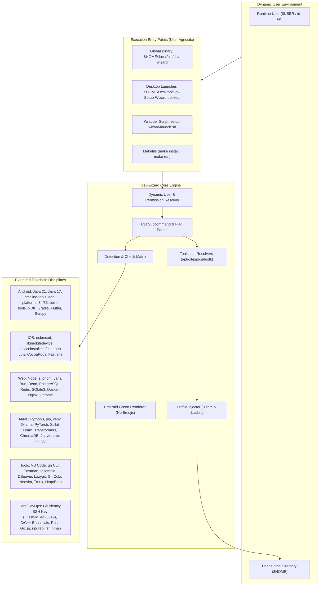

# System Architecture & Implementation Specification: Dev-Wizard CLI

**System:** `dev-wizard` (Development Environment & Toolchain Orchestrator)  
**Target Platform:** Linux (Debian, Ubuntu, Kali, Mint, Pop!_OS)  
**Shell Runtime:** POSIX Bash 4.4+  
**Design Standard:** Minimalist Terminal / Emerald Green Monochrome Theme (Zero Emojis)  
**User Resolution:** 100% Dynamic User & Multi-User Agnostic

---

## 1. Architectural Overview & Dynamic User Isolation

The system does not hardcode any user (`bonnie` or otherwise). All path resolutions, environment configurations, and desktop launcher executions dynamically inspect:
- Current Runtime User: `CURRENT_USER="$(id -un)"`
- Target Home Directory: `USER_HOME="${HOME:-/home/$CURRENT_USER}"`
- Dynamic Desktop Launcher: Executed via POSIX shell variable expansion (`$HOME`) with runtime self-healing and checksum registration.



---

## 2. Dynamic Desktop Launcher Architecture

FreeDesktop specification forbids static environment variable expansion in `Exec=` fields unless wrapped by a shell. `Dev-Setup-Wizard.desktop` uses an intelligent dynamic shell wrapper:

```ini
[Desktop Entry]
Version=1.0
Type=Application
Name=Dev Environment Setup Wizard
Comment=Modular Dev-Environment Toolchain Orchestrator
Exec=bash -c 'U_HOME="$HOME"; [ -z "$U_HOME" ] && U_HOME="/home/$(id -un)"; LAUNCH="$U_HOME/Desktop/setup-wizard/launch.sh"; [ ! -f "$LAUNCH" ] && LAUNCH="$U_HOME/setup-wizard/launch.sh"; if [ -f "$LAUNCH" ]; then exec "$LAUNCH"; elif command -v dev-wizard >/dev/null 2>&1; then exec dev-wizard; else echo "Launcher not found in $U_HOME"; sleep 3; fi'
Icon=utilities-terminal
Terminal=false
Categories=Development;
StartupNotify=true
```

### Self-Healing & Automatic Checksum Registration
Whenever `dev-wizard`, `make install`, or `launch.sh` executes:
1. It queries `CURRENT_USER="$(id -un)"` and `CURRENT_HOME="$HOME"`.
2. It generates the exact SHA-256 hash of the desktop file.
3. It sets `metadata::xfce-exe-checksum` via `gio` for the active user, guaranteeing double-click execution without security warnings on XFCE/GNOME.

---

## 3. Comprehensive Toolchain Matrix by Discipline

### 01. Android Development
- **Java 21 LTS (`openjdk-21-jdk`)**: Primary modern Android runtime
- **Java 17 LTS (`openjdk-17-jdk`)**: Compatible fallback runtime for legacy Gradle projects
- **Android Command-Line Tools (`sdkmanager`)**: CLI SDK manager without Android Studio
- **Android Platform-Tools (`adb`, `fastboot`)**: Debugger, device bridge, and bootloader tools
- **Android SDK Platforms (API 34 & 36)**: Android 14 & 16 developer targets
- **Android Build-Tools (28.0.3, 34.0.0, 35.0.0)**: Compilers, d8, apksigner, zipalign
- **Android NDK**: Native C/C++ development kit
- **Gradle**: Native system build automation tool
- **Flutter SDK (Stable Channel)**: Cross-platform client framework
- **Scrcpy**: High-performance USB/wireless screen mirroring & device control

### 02. iOS Development (Linux Tools & Cross-Platform)
- **usbmuxd**: USB multiplexer daemon for iOS hardware connection
- **libimobiledevice**: Native communication library and CLI (`ideviceinfo`, `ideviceenterrecovery`)
- **ideviceinstaller**: App management and IPA installation on attached iOS devices
- **ifuse**: FUSE filesystem driver to mount iOS devices on Linux
- **libplist-utils**: Property list converter (XML/binary plist conversion)
- **CocoaPods & Ruby**: Dependency manager for cross-platform iOS projects
- **Fastlane**: Continuous deployment & app store publishing automation

### 03. Web Development
- **Node.js LTS & npm**: Standard JavaScript server runtime and package registry
- **pnpm & yarn**: High-efficiency alternative package managers
- **Bun**: Ultra-fast all-in-one JavaScript/TypeScript runtime & bundler
- **Deno**: Modern secure runtime for TypeScript and JavaScript
- **PostgreSQL**: Production-grade relational database server and `psql` client
- **Redis**: High-throughput in-memory key-value database & caching engine
- **SQLite3**: Embedded SQL database engine and development libraries
- **Docker Engine & Docker Compose**: Containerized application virtualization
- **Nginx**: High-performance web server, reverse proxy, and SSL terminator
- **Chromium / Google Chrome**: Headless browser automation and web development

### 04. AI & Machine Learning Development
- **Python 3, pip, venv & python3-dev**: Python base development environment
- **Ollama**: Local LLM runner (Llama 3, DeepSeek, Gemma, Mistral)
- **Core AI Stack**: NumPy, Pandas, SciPy, Matplotlib, Seaborn
- **Deep Learning Framework**: PyTorch, Torchvision, Torchaudio
- **Machine Learning Suite**: Scikit-Learn, XGBoost, LightGBM
- **NLP & Transformers Stack**: Hugging Face Transformers, Datasets, Tokenizers, Accelerate
- **Vector Database & Embeddings**: ChromaDB, Sentence-Transformers
- **JupyterLab & Notebook**: Interactive web browser data science IDE
- **Hugging Face Hub CLI**: Model and dataset download utility

### 05. Development Softwares & IDEs
- **Visual Studio Code (VS Code)**: Flagship extensible code editor
- **GitHub CLI (`gh`)**: Official command-line tool for GitHub issues, PRs, and repos
- **Postman**: Comprehensive API design, mock, and testing platform
- **Insomnia**: Fast REST and GraphQL testing client
- **DBeaver Community**: Multi-platform database management GUI
- **Lazygit**: High-speed terminal UI for Git operations
- **Git GUI Tools (Git Cola, Gitk)**: Visual branch visualizers
- **Neovim**: High-performance extensible terminal editor
- **Tmux & Htop / Btop**: Terminal multiplexer and modern system activity monitors

### 06. Core System Tools & DevOps / Security
- **Git CLI & Global Identity**: `user.name`, `user.email`, `init.defaultBranch main`
- **GitHub SSH Key**: Ed25519 authentication with automatic public key deployment test
- **C/C++ Build Essentials**: `gcc`, `g++`, `clang`, `cmake`, `ninja-build`, `pkg-config`, `libgtk-3-dev`
- **Rust Toolchain**: `rustup`, `rustc`, `cargo`
- **Go Programming Language**: `golang-go` runtime and compiler
- **Modern CLI Utilities**: `curl`, `wget`, `jq`, `ripgrep`, `fzf`
- **Network Diagnostic Utilities**: `nmap`, `netcat`, `tcpdump`

---

## 4. CLI Command Reference for Power Users

```bash
# Global installation for any user:
cd setup-wizard
make install

# Diagnostic Commands:
dev-wizard scan            # Full multi-category scan
dev-wizard scan android    # Check Android & Flutter stack
dev-wizard scan web        # Check Web stack
dev-wizard scan ai         # Check AI & Machine Learning stack
dev-wizard scan tools      # Check IDEs & Dev Softwares
dev-wizard scan core       # Check Core DevOps, Rust, Go, Git

# Headless Selective Provisioning:
dev-wizard install web 1,3,4   # Install specific uninstalled tools
dev-wizard install ai all      # Provision complete AI/ML stack
dev-wizard install android all # Provision complete Android CLI stack

# System Diagnostics:
dev-wizard doctor          # Flutter Doctor & Android toolchain verification
dev-wizard --version       # Print version
dev-wizard --help          # Print comprehensive manual
```
