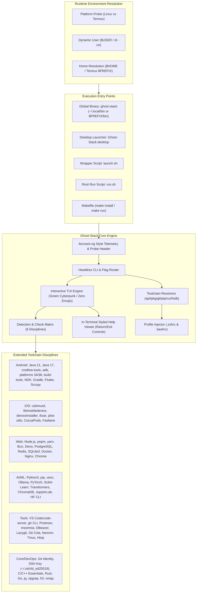

# System Architecture & Implementation Specification: Ghost-Stack

**System:** `Ghost-Stack` (Modular Development Environment & Toolchain Orchestrator)  
**Target Platform:** Linux (Debian, Ubuntu, Kali, Mint, Pop!_OS) & Android (Termux)  
**Shell Runtime:** POSIX Bash 4.4+  
**Design Standard:** Minimalist Cyberpunk Terminal / Emerald Green Monochrome Theme (Zero Emojis)  
**Launch Telemetry:** Aircrack-ng Style Initialization & Telemetry Header  
**User Resolution:** 100% Dynamic User & Multi-User Agnostic (Linux & Termux)

---

## 1. Architectural Overview & Platform Agnostic Design

Ghost-Stack dynamically adapts to both desktop Linux operating systems and Android devices running Termux. All path resolutions, environment configurations, and desktop launcher executions dynamically inspect the runtime environment without hardcoded usernames or fixed system paths.



---

## 2. Termux on Android Compatibility Engine

Ghost-Stack features full native support for Android Termux:
1. **Dynamic Platform Detection:**
   ```bash
   IS_TERMUX=false
   if [ -n "$TERMUX_VERSION" ] || [ -d "/data/data/com.termux" ] || [[ "${PREFIX:-}" =~ "com.termux" ]]; then
       IS_TERMUX=true
   fi
   ```
2. **Rootless Package Management (`pkg_install`):**
   Automatically falls back to `pkg install -y` or `apt-get install -y` without requesting `sudo`.
3. **Dynamic Temporary Directory:**
   Automatically redirects scratch extractions and downloads to `${PREFIX:-$HOME}/tmp` instead of `/tmp`.
4. **Binary Target Resolution:**
   Installs global binaries to `$PREFIX/bin` on Termux and `~/.local/bin` on Linux.

---

## 3. Dedicated Home Screen Telemetry Layout (Dual-Column Architecture)

On the primary home screen (`tui_main`), Ghost-Stack renders an elegant, spacious 2-column diagnostic telemetry frame displaying host telemetry, CPU speed, and real-time memory and storage metrics before presenting the discipline options:
```text
  ┌─[ SYSTEM ENVIRONMENT TELEMETRY ]───────────────────────────────────────────────────────────────────────┐
  │                                                                                                        │
  │   [*] Architecture    : x86_64                      [*] CPU Speed       : 2.50 GHz                     │
  │   [*] Operating System: Kali GNU/Linux Rolling      [*] Active Session  : bonnie                       │
  │   [*] Memory (RAM)    : 4.5Gi / 7.6Gi (3.1Gi Free)  [*] Disk Storage    : 57G / 226G (158G Free)       │
  │   [*] Runtime Platform: Native Linux (APT)          [*] Workspace Path  : ~/Desktop/setup-wizard       │
  │                                                                                                        │
  └────────────────────────────────────────────────────────────────────────────────────────────────────────┘
```
**Key Telemetry Capabilities:**
- **CPU Speed:** Dynamically detects real-time clock frequency via `/sys/devices/system/cpu/cpufreq`, `/proc/cpuinfo`, or `lscpu`.
- **Memory (RAM):** Reports active memory usage, total system capacity, and free/available memory via `free -h` or `/proc/meminfo`.
- **Disk Storage:** Reports current workspace partition storage usage, total disk size, and available free space via `df -h`.
- **Submenu Isolation:** When the user enters any submenu, discipline category, or help manual, this telemetry box is automatically hidden to keep navigation focused. It reappears only when returning to the main menu.
The terminal prompt is dynamically scoped:
- Main Menu: `ghost-stack > `
- Discipline Submenu: `ghost-stack(android) > `, `ghost-stack(web) > `
- Help Manual: `ghost-stack(help) > `

---

## 4. In-Terminal Help Navigation Engine

The help viewer (`render_help_viewer`) presents a structured frame with multi-option navigation controls:
- `[ B ] Return to Help Menu`: Returns to the main Help & Navigation manual.
- `[ M ] Return to Main Menu`: Directly returns to the Ghost-Stack primary discipline selector.
- `[ 0 / Q ] Exit Ghost-Stack`: Immediately terminates execution cleanly.

Input parsing accepts keystrokes (`b`, `B`, `back`, `m`, `M`, `main`, `0`, `q`, `Q`, `exit`, `quit`).

---

## 5. Comprehensive Toolchain Matrix by Discipline

### 01. Android Development (`android`)
- **Java 21 LTS (`openjdk-21-jdk`)**: Primary modern Android runtime
- **Java 17 LTS (`openjdk-17-jdk`)**: Compatible fallback runtime for legacy Gradle projects
- **Android Command-Line Tools (`sdkmanager`)**: CLI SDK manager without Android Studio
- **Android Platform-Tools (`adb`, `fastboot`)**: Debugger, device bridge, and bootloader tools
- **Android SDK Platforms (API 34 & 36)**: Android 14 & 16 developer targets
- **Android Build-Tools (28.0.3, 34.0.0)**: Compilers, d8, apksigner, zipalign
- **Android NDK**: Native C/C++ development kit
- **Gradle**: Native system build automation tool
- **Flutter SDK (Stable Channel)**: Cross-platform client framework
- **Scrcpy**: High-performance USB screen mirroring & device control

### 02. iOS Development (`ios`)
- **usbmuxd**: USB multiplexer daemon for iOS hardware connection
- **libimobiledevice**: Native communication library and CLI (`ideviceinfo`)
- **ideviceinstaller**: App management and IPA installation on attached iOS devices
- **ifuse**: FUSE filesystem driver to mount iOS devices on Linux
- **libplist-utils**: Property list converter (XML/binary plist conversion)
- **CocoaPods & Ruby**: Dependency manager for cross-platform iOS projects
- **Fastlane**: Continuous deployment & app store publishing automation

### 03. Web Development (`web`)
- **Node.js LTS & npm**: Standard JavaScript server runtime and package registry
- **pnpm & yarn**: High-efficiency alternative package managers
- **Bun**: Ultra-fast all-in-one JavaScript/TypeScript runtime & bundler
- **Deno**: Modern secure runtime for TypeScript and JavaScript
- **PostgreSQL**: Production-grade relational database server and `psql` client
- **Redis**: High-throughput in-memory key-value database & caching engine
- **SQLite3**: Embedded SQL database engine and development libraries
- **Docker Engine & Docker Compose**: Containerized application virtualization
- **Nginx**: High-performance web server, reverse proxy, and SSL terminator
- **Chromium / Google Chrome**: Headless browser automation and web development

### 04. AI & Machine Learning Development (`ai`)
- **Python 3, pip, venv & dev**: Python base development environment
- **Ollama**: Local LLM runner (Llama 3, DeepSeek, Gemma, Mistral)
- **Core AI Stack**: NumPy, Pandas, SciPy, Matplotlib, Seaborn
- **Deep Learning Framework**: PyTorch, Torchvision, Torchaudio
- **Machine Learning Suite**: Scikit-Learn, XGBoost, LightGBM
- **NLP & Transformers Stack**: Hugging Face Transformers, Datasets, Tokenizers, Accelerate
- **Vector Database & Embeddings**: ChromaDB, Sentence-Transformers
- **JupyterLab & Notebook**: Interactive web browser data science IDE
- **Hugging Face Hub CLI**: Model and dataset download utility

### 05. Development Softwares & IDEs (`tools`)
- **Visual Studio Code (VS Code / Code-Server)**: Flagship extensible code editor
- **GitHub CLI (`gh`)**: Official command-line tool for GitHub issues, PRs, and repos
- **Postman**: Comprehensive API design, mock, and testing platform
- **Insomnia**: Fast REST and GraphQL testing client
- **DBeaver Community**: Multi-platform database management GUI
- **Lazygit**: High-speed terminal UI for Git operations
- **Git GUI Tools (Git Cola, Gitk)**: Visual branch visualizers
- **Neovim**: High-performance extensible terminal editor
- **Tmux & Htop / Btop**: Terminal multiplexer and modern system activity monitors

### 06. Core System Tools & DevOps (`core`)
- **Git CLI & Global Identity**: `user.name`, `user.email`, `init.defaultBranch main`
- **GitHub SSH Key**: Ed25519 authentication with automatic public key deployment test
- **C/C++ Build Essentials**: `gcc`, `g++`, `clang`, `cmake`, `ninja-build`, `pkg-config`
- **Rust Toolchain**: `rustup`, `rustc`, `cargo`
- **Go Programming Language**: `golang-go` runtime and compiler
- **Modern CLI Utilities**: `curl`, `wget`, `jq`, `ripgrep`, `fzf`
- **Network Diagnostic Utilities**: `nmap`, `netcat`, `tcpdump`

---

## 6. CLI Command Reference for Tech Gurus

```bash
# Global installation:
cd setup-wizard
make install

# Diagnostic Commands:
ghost-stack scan            # Full multi-category scan
ghost-stack scan android    # Check Android & Flutter stack
ghost-stack scan web        # Check Web stack
ghost-stack scan ai         # Check AI & Machine Learning stack
ghost-stack scan tools      # Check IDEs & Dev Softwares
ghost-stack scan core       # Check Core DevOps, Rust, Go, Git

# Headless Selective Provisioning:
ghost-stack install web 1,3,4   # Install specific uninstalled tools
ghost-stack install ai all      # Provision complete AI/ML stack
ghost-stack install android all # Provision complete Android CLI stack

# System Diagnostics:
ghost-stack doctor          # Flutter Doctor & Android toolchain verification
ghost-stack --version       # Print version and system telemetry
ghost-stack --help          # Print comprehensive manual
```
